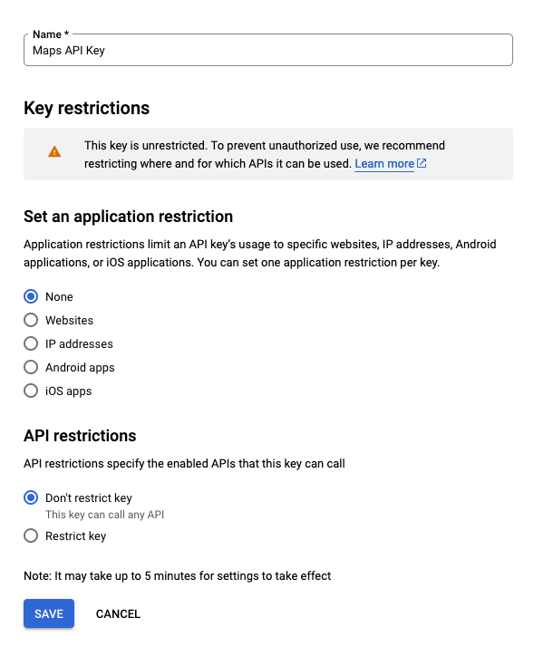
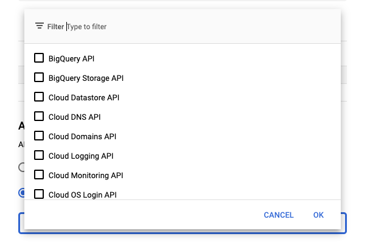
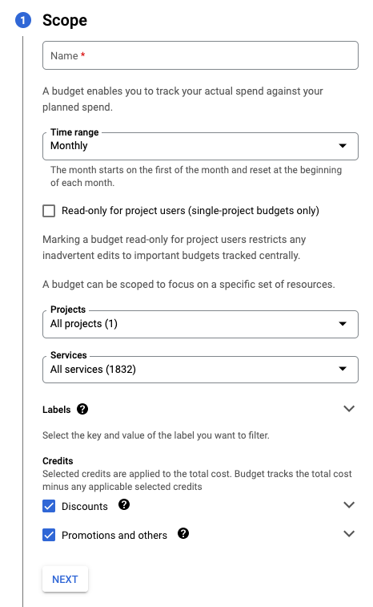
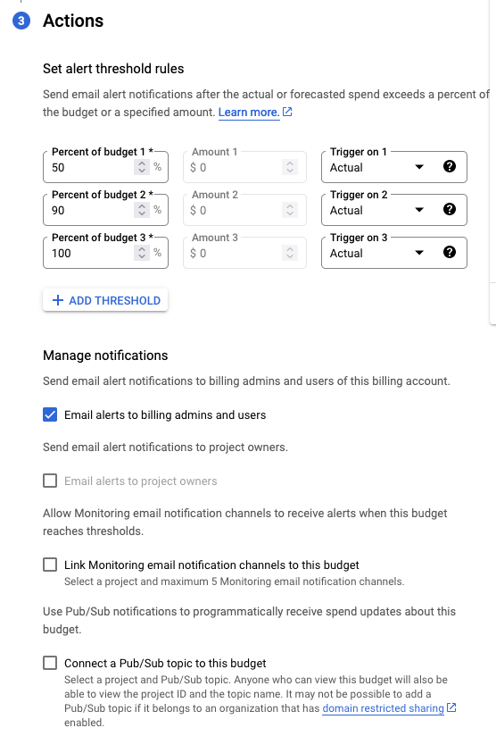
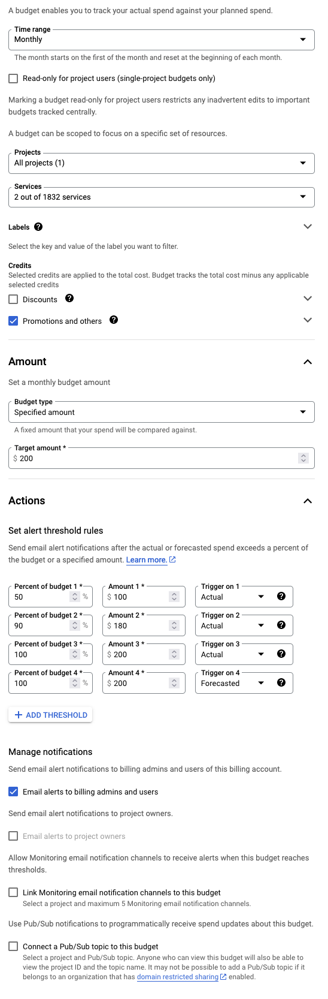

If you've ever dabbled with Google Maps API, you know it's not exactly easy on the pocket. But the cost isn't the only thing you should be mindful of. It's equally crucial to ensure that your API keys are kept safe and sound, so you can enjoy all its features without any security worries.

Using Google Maps API can transform your projects, allowing you to offer interactive mapping features that many users have come to expect in today's digital landscape. Whether it's pinpointing store locations, showcasing property listings, or charting out a traveler's journey, Google Maps API has consistently proven its value. But with great power comes great responsibility, especially when it comes to online security.

## Why You Should Protect Your API Key

The API key is, in essence, the digital key to a treasure trove of features and data. If it falls into the wrong hands, you could end up with unexpected charges, misuse of the service, or worse, malicious activities under your account's name. Imagine a scenario where someone uses your API key to generate millions of unnecessary requests. Not only would this slow down your application, but it might also lead to unexpected, exorbitant costs.

## Tips to Keep Your API Key Secure

1. **Restrict by IP Address or Referrer:** Google Maps API allows you to set which IP addresses or websites (referrers) can use your API key. By setting this up, you can ensure that only your applications or websites can make calls using your key.

2. **Use Application Restrictions:** Make use of application restrictions. By doing so, you determine which APIs can be accessed with your key, adding an extra layer of security.

3. **Rotate Keys Regularly:** Change your API key periodically. This minimizes the risk even if a key was compromised in the past.

4. **Monitor Usage:** Keep an eye on your API's usage statistics. Unusual spikes or irregular patterns might indicate misuse.

5. **Create a budget:** While not itself a security feature, creating a budget for the API keys keeps you on top of the usage of the APIs, and can help detect inappropriate usage of the API.

6. **Stay Updated:** Google often rolls out updates and best practices. Make it a habit to keep yourself informed and adjust your security settings accordingly.

## How to

### 1. Restrict Access

- Login to [Google cloud Console](https://console.cloud.google.com/) and select your project.
- From the top left menu, select more products then scroll down to **Other Google Products** and select **Google Maps Platform**
- Select `Keys & Credentials`
- Select any of your Google Maps Apis to go to the settings page
- Use the **Set an application restriction** menu to restrict who can access Google maps using this api key.
  - Select Websites, if using the API from a website.
  - Select IP Addresses to limit the access to specific servers. I'd mainly use this option when using the maps API from a backend. You can specify the IP addresses in any of the following formats:
    - IPv4 (198.51.100.1)
    - IPv6 (2001:db8::1)
    - A subnet using CIDR notation (198.51.100.0/24, 2001:db8::/64)
  - Android and iOS apps options can be used to restrict the API key to a specific mobile app platform
    - More info available [here](https://cloud.google.com/docs/authentication/api-keys#android)
- Use the **API restrictions** menu to restrict the APIs that this key can use
  - choose restrict key, then choose which APIs can this key use.

### 2. Rotate Keys

- This practice is recommended to be done every so often to enhance the security of the keys by constantly changing them.
- Use steps from the previous paragraph to go to one of your API Keys.
- Click on the `regenerate key` button on the top of the page to regenerate the Key.
- Make sure to update the key wherever it is being used.
- This can also be automated using the `gcloud` cli and included as part of a CI/CD pipeline.

### 3. Create budgets

- After logging in to the [Google cloud Console](https://console.cloud.google.com/) and selecting your project.
- Go to the top left menu, select more products then select **Billing**
- From the Billing menu, select `Budgets & alerts`
- Click `Create Budget`

  1. Under **Scope** give the budget a name, Time range, decide whether to make it read-only or not.
    - Choose the project(s) for which this budget will apply.
    - Choose the services. I prefer to choose all the google maps services in one budget in order to know the usage against the free credits. Unfortunately, you can't filter all the google maps services in one filter, but choose all the APIs that you are using, or all the APIs that are being used by one API key.
    - Under credits, keep only `Promotions and others` selected, in order to reflect the free Google maps credits.

  2. Under **Amount** choose the Target amount for your budget
    - in order to monitor the free credits, choose the target amount as $200 which is the amount of free credits granted.

  3. Under **Actions** choose the alerts that you would like to receive
    - You can set different alerts, while Google suggests 50%,90%,100%.
    - You can also choose whether an alert is to be sent in case the **actual** percentage has been reached, or the percentage is **forecasted** to be reached by the end of the budget period.

- Here's a sample budget that I have set for the `Places API`

## Conclusion

While the Google Maps API is an incredible tool that can significantly enhance your applications, it's essential to handle it with care. Remember, online security is a constant dance between staying updated, being vigilant, and implementing best practices. Keep your API key safe, and you'll ensure that your projects run smoothly and securely.

